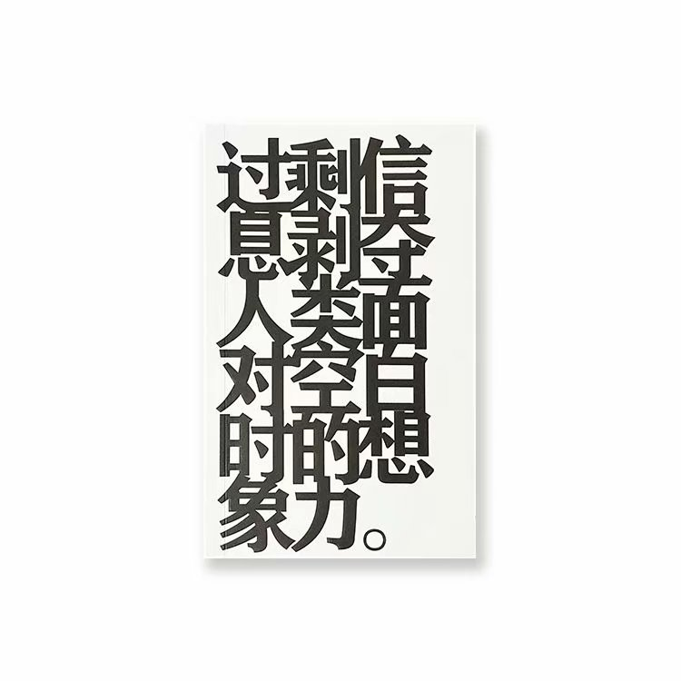
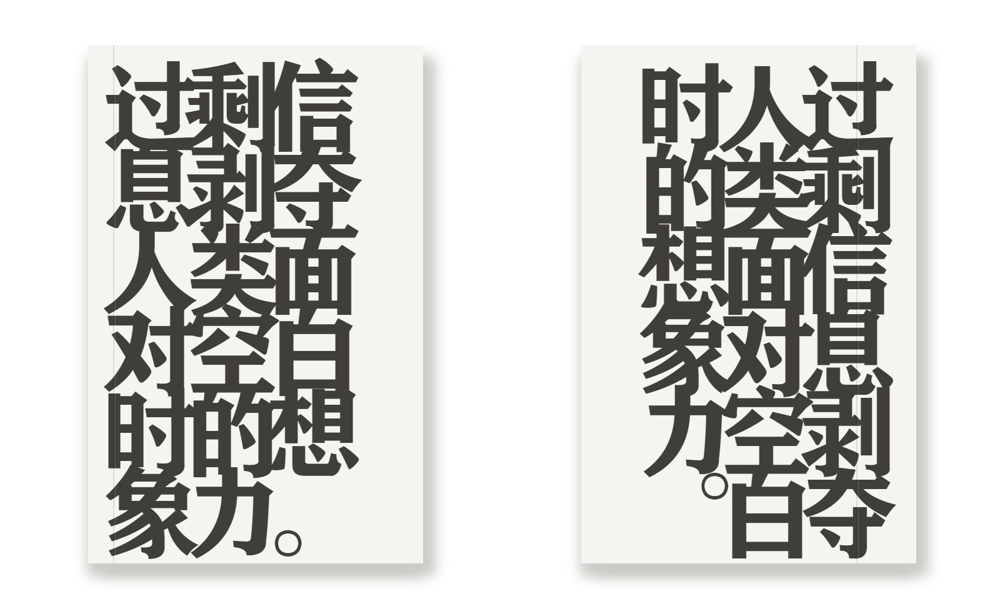

# Excessive-information-deprives-human-beings-of-their-imagination-when-faced-with-blankness
「过剩信息剥夺人类面对空白时的想象力。」的CSS实现

## 缘由

最初看到了这个笔记本，被其中的设计打动了，于是我就用CSS仿制了一个，完美模仿凹痕，另外加了竖排。

## 效果

原版：

我实现的版本：

[官方淘宝店](https://item.taobao.com/item.htm?id=642777696656)

你可以在[这个页面](https://myuan.fun/assets/html/%E8%BF%87%E5%89%A9%E4%BF%A1%E6%81%AF%E5%89%A5%E5%A4%BA%E4%BA%BA%E7%B1%BB%E9%9D%A2%E5%AF%B9%E7%A9%BA%E7%99%BD%E6%97%B6%E7%9A%84%E6%83%B3%E8%B1%A1%E5%8A%9B.html)预览，在网页上预览需要安装「方正粗黑宋简体」